# Сети в Linux

Настройка сетей в Linux на виртуальных машинах.

## Part 1. Инструмент **ipcalc**
`-` Итак, начнём наше погружение в удивительный мир сетей со знакомства с IP адресами. А использовать для этого мы будем инструмент **ipcalc**.

**== Задание ==**

##### Подними виртуальную машину (далее -- ws1)

#### 1.1. Сети и маски
##### Определи и запиши в отчёт:
##### 1) Адрес сети *192.167.38.54/13*
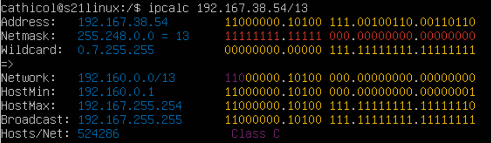
##### 2) Перевод маски *255.255.255.0* в префиксную и двоичную запись, */15* в обычную и двоичную, *11111111.11111111.11111111.11110000* в обычную и префиксную
       /24, 11111111.11111111.11111111.00000000;
       255.254.0.0, 11111111.11111110.00000000.00000000;
       255.255.255.240, /28;
##### 3) Минимальный и максимальный хост в сети *12.167.38.4* при масках: */8*, *11111111.11111111.00000000.00000000*, *255.255.254.0* и */4*
        12.0.0.1, 12.255.255.254;
        12.167.0.1, 12.167.255.254;
        12.167.38.1, 12.167.38.254;
        0.0.0.1, 15.255.255.254;
#### 1.2. localhost
##### Определи и запиши в отчёт, можно ли обратиться к приложению, работающему на localhost, со следующими IP: *194.34.23.100*, *127.0.0.2*, *127.1.0.1*, *128.0.0.1*
        нет, да, да, нет.
#### 1.3. Диапазоны и сегменты сетей
##### Определи и запиши в отчёт:
##### 1) Какие из перечисленных IP можно использовать в качестве публичного, а какие только в качестве частных: *10.0.0.45*, *134.43.0.2*, *192.168.4.2*, *172.20.250.4*, *172.0.2.1*, *192.172.0.1*, *172.68.0.2*, *172.16.255.255*, *10.10.10.10*, *192.169.168.1*
        10.0.0.45 - частный, 
        134.43.0.2 - публичный, 
        192.168.4.2 - частный, 
        172.20.250.4 - частный,
        172.0.2.1 - публичный,
        192.172.0.1 - публичный,
        172.68.0.2 - публичный,
        172.16.255.255 - частный,
        10.10.10.10 - частный,
        192.169.168.1 - публичный.

##### 2) Какие из перечисленных IP адресов шлюза возможны у сети *10.10.0.0/18*: *10.0.0.1*, *10.10.0.2*, *10.10.10.10*, *10.10.100.1*, *10.10.1.255*
        10.10.0.2;
        10.10.10.10;
        10.10.1.255.
## Part 2. Статическая маршрутизация между двумя машинами

* Поднимаем вторую ВМ
* С помощью команды `ip a` смотрим существующие сетевые интерфейсы:
* ws1\
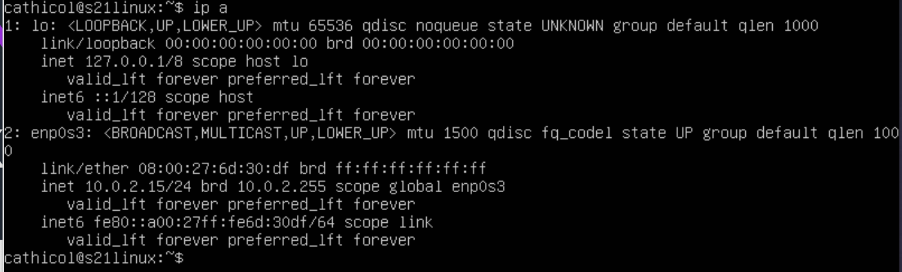\
* ws2\
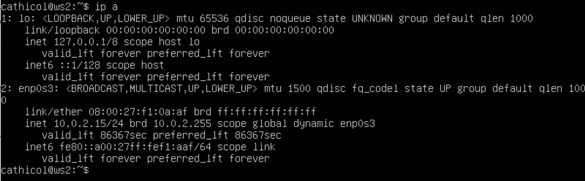\
* Опишем сетевой интерфейс, соответствующий внутренней сети, на обеих машинах:\
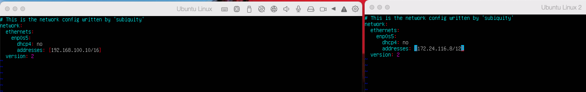\
* Выполним команду `netplan apply` для перезапуска сервиса сети\
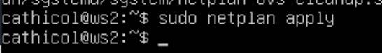\

### 2.1. Добавление статического маршрута вручную

* Добавили статический маршрут от одной машины до другой и обратно при помощи команд `sudo ip route add 192.168.100.10 via 172.24.116.8` и `sudo ip route add 172.24.116.8 via 192.168.100.10`.
\
\
* Пропингуем соединение между машинами.
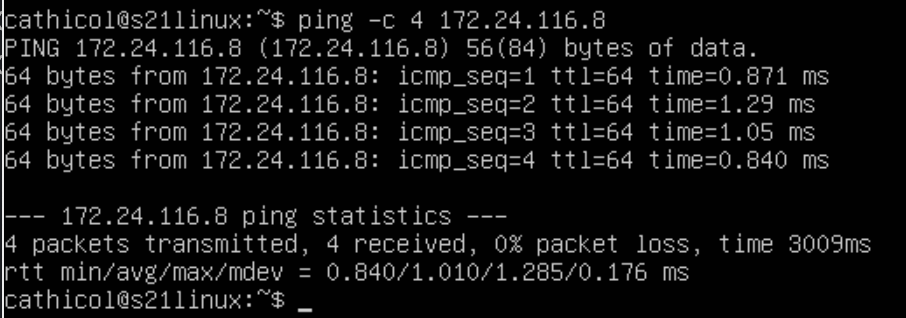\
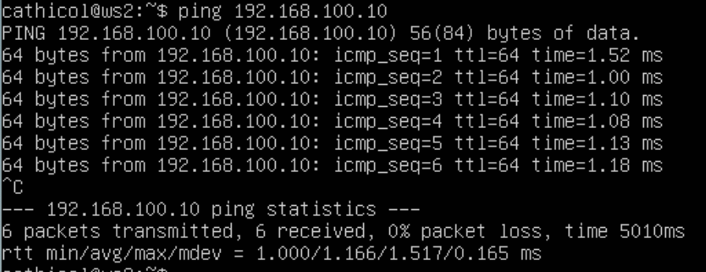\
### 2.2. Добавление статического маршрута с сохранением

* Перезапустим машины при помощи `sudo reboot`.
* Добавим статический маршрут от одной машины до другой с помощью файла etc/netplan/00-installer-config.yaml
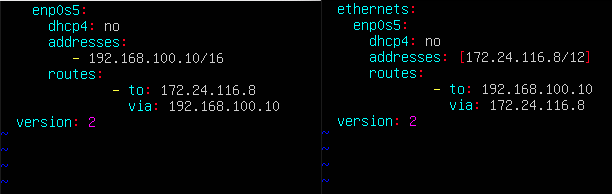\
* Пропингуем соединение между машинами.
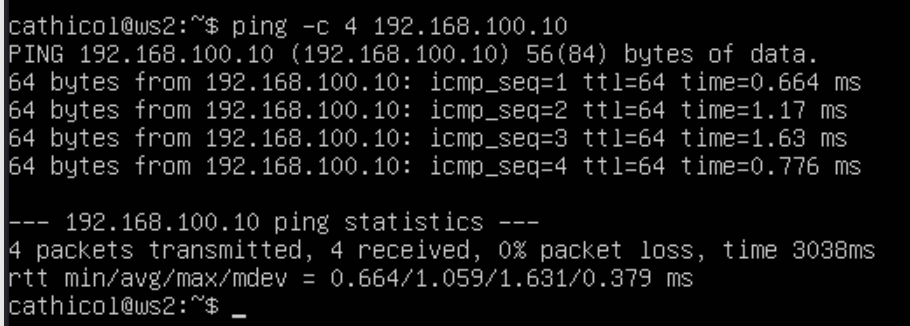\

## Part 3. Утилита iperf3

### 3.1. Скорость соединения

* 8 Mbps = 1 MB/s
* 100 MB/s = 819200 Kbps
* 1 Gbps = 1024 Mbps

### 3.2. Утилита iperf3

* Передано 5.89 Gbytes со скоростью 5.04 Gbytes/sec\
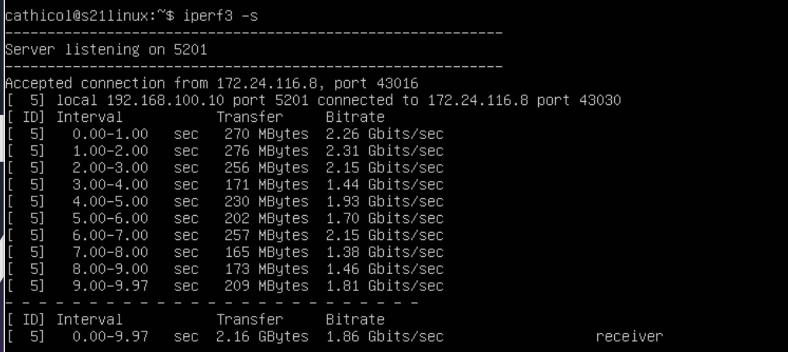\
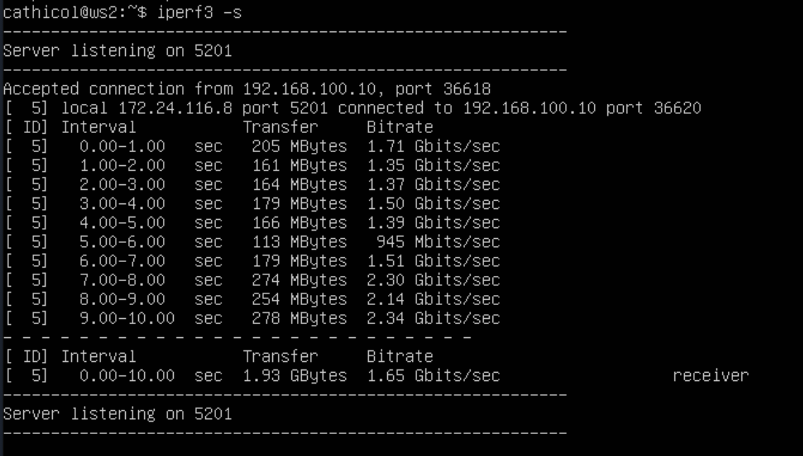\

## Part 4. Сетевой экран

### 4.1. Утилита iptables
* Создаем файл `sudo vim /etc/firewall.sh`
* Добавляем правила
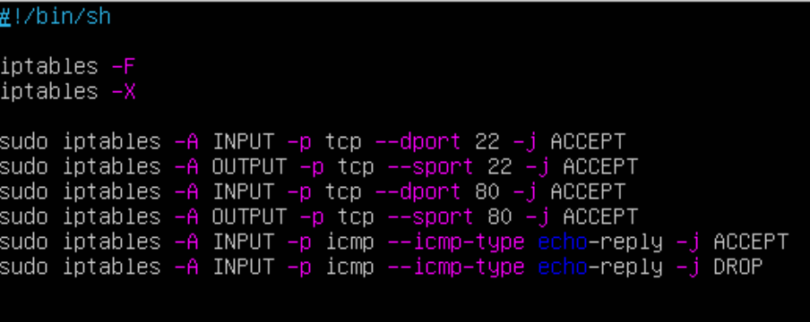\
* Запуск файлов на обеих машинах командами `chmod +x /etc/firewall.sh` и `/etc/firewall.sh`\

> Правила в iptables имеют приоритезацию, т.е. выполняются все попорядку сверху вниз. Таким образом, пакеты icmp на ws1 сначало попадут в правило DROP, а потом в ACCEPT и соответственно входящий трафик по протаколу icmp пойдет дальше. А вот на ws2 все наооброт.

### 4.2. Утилита nmap

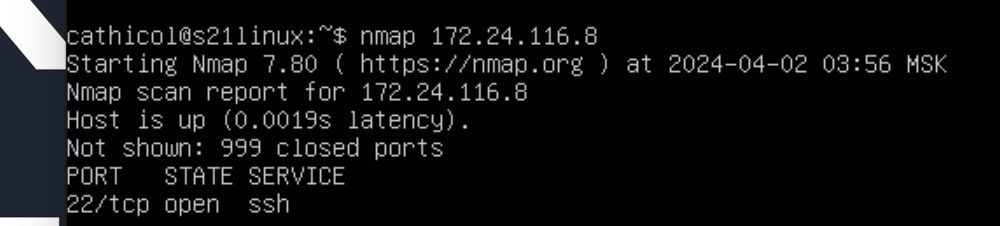\

## Part 5. Статическая маршрутизация сети
Сеть: \

### 5.1. Настройка адресов машин

* Поднял 5 виртуальных машин (3 рабочие станции (ws11, ws21, ws22) и 2 роутера (r1, r2)).
* Настроил конфигурации машин в `etc/netplan/00-installer-config.yaml` согласно сети на рисунке.
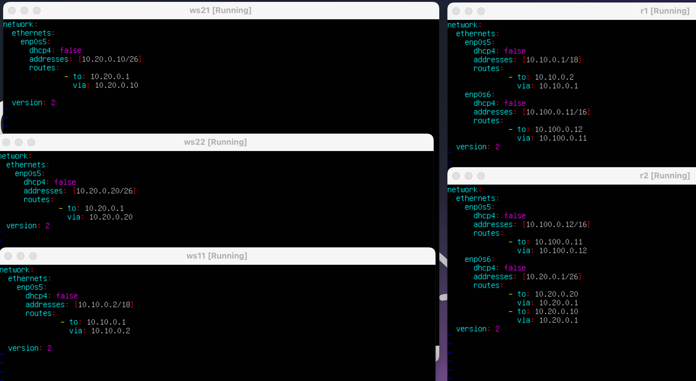\
* Перезапустил сервис сети. Командой `ip -4 a` проверил, что адрес машины задан верно, также пропинговал ws22 с ws21 и аналогично пропинговал r1 с ws11.
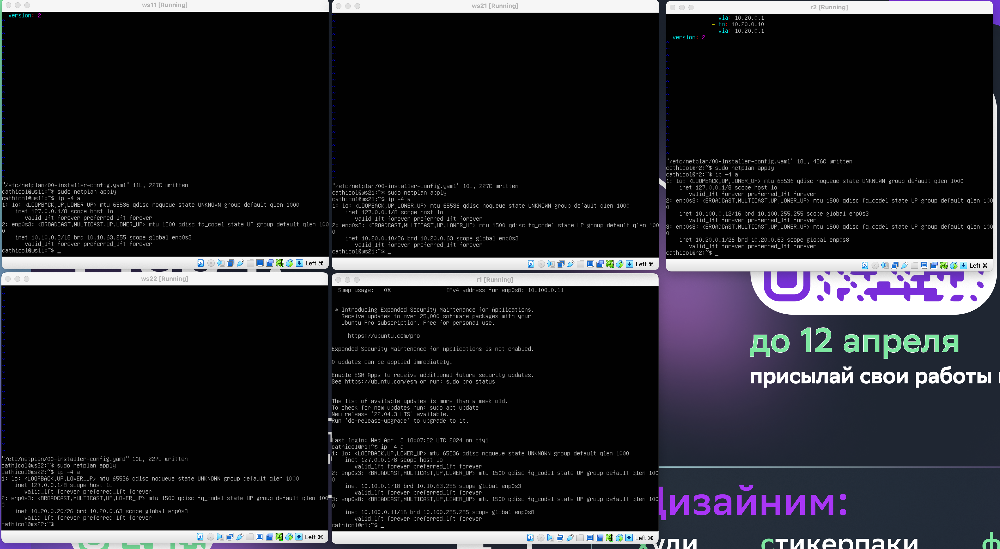\
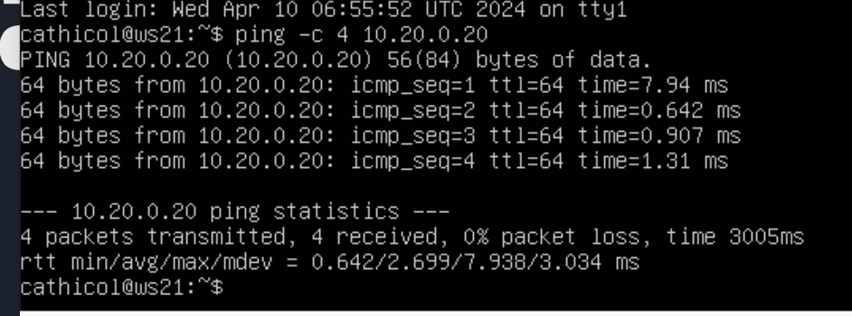\
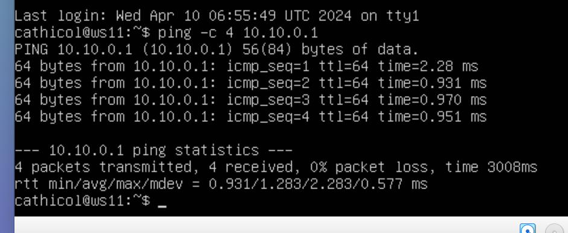\
### 5.2. Включение переадресации IP-адресов

* Для включения переадресации IP, выполнил команду на роутерах: \
`sysctl -w net.ipv4.ip_forward=1`

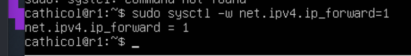\
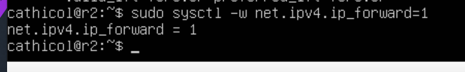\
* Открой файл /etc/sysctl.conf и добавь в него следующую строку: \
net.ipv4.ip_forward = 1

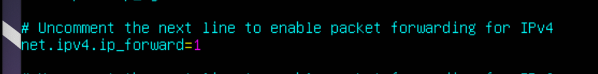\

### 5.3. Установка маршрута по-умолчанию

* Настроим маршрут по-умолчанию (шлюз) для рабочих станций. Для этого добавим `default` перед IP роутера в файле конфигураций.\
\
* Пропингуем с ws11 роутер r2 и покажи на r2, что пинг доходит. Для этого используем команду:\
`tcpdump -tn -i eth0`\
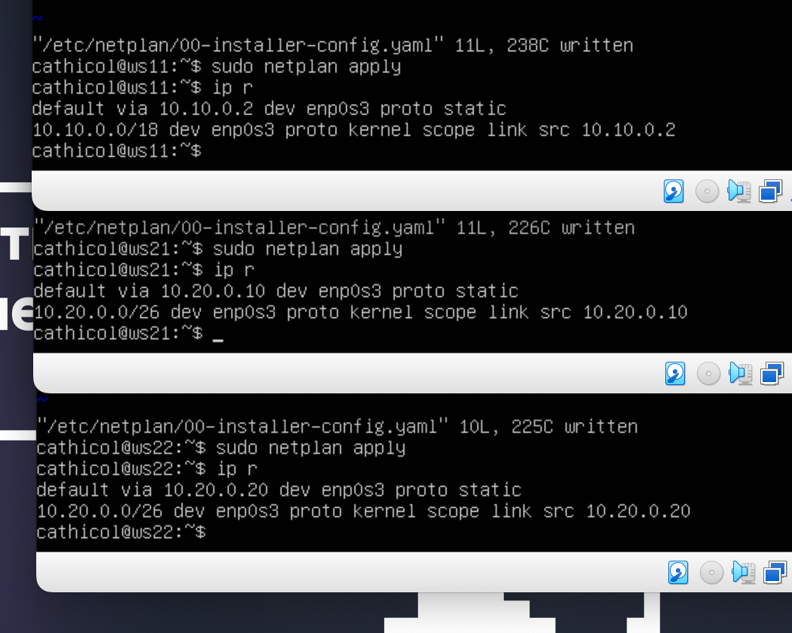\

### 5.4. Добавление статических маршрутов

* Добавим в роутеры r1 и r2 статические маршруты в файле конфигураций\
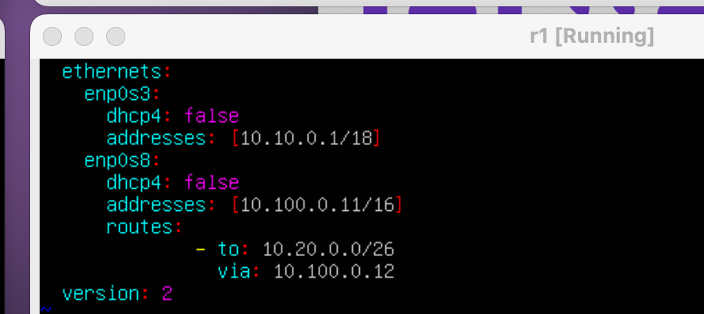\
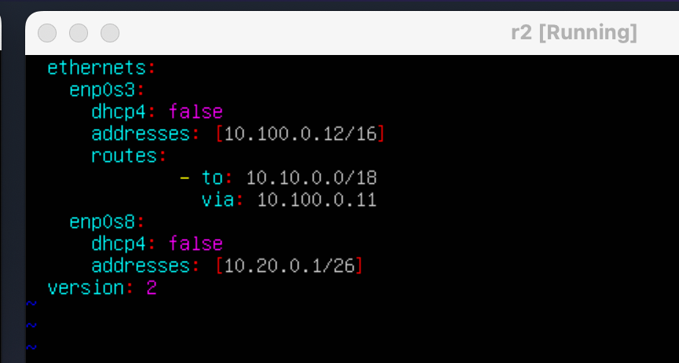\
* Вызовем `ip r` и покажем таблицы с маршрутами на обоих роутерах\
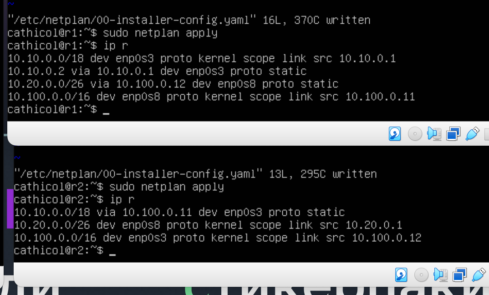
* Запустим команды на ws11:\
`ip r list 10.10.0.0/18` и `ip r list 0.0.0.0/0`\
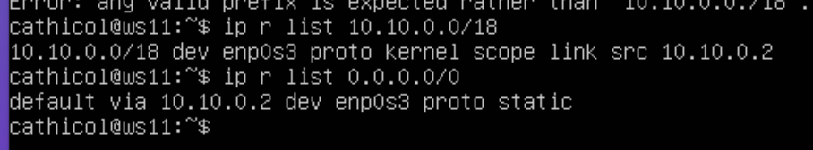\
Если выбран маршрут, отличный от 0.0.0.0/0 для адреса 10.10.0.0/маска сети, значит в таблице маршрутизации имеется запись с более точным маршрутом, который указывает конкретный путь для доставки пакета на узел сети назначения.

### 5.5. Построение списка маршрутизаторов
* Запустил на r1 команду дампа \
`sudo tcpdump -tnv -i enp0s7`
* При помощи утилиты traceroute построим список маршрутизаторов на пути от ws11 до ws21.
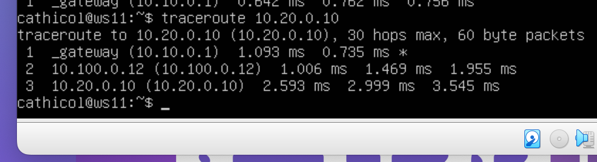\
Traceroute использует метод, при котором при отправке пакета устанавливается значение TTL в хедере IP пакета. При прохождении каждого маршрутизатора это значение уменьшается на единицу. Когда значение TTL достигает нуля, маршрутизатор отправляет ICMP пакет с сообщением "Time Exceeded" и своим IP-адресом обратно. Traceroute повторяет этот процесс, увеличивая значение TTL и записывая IP-адреса всех пройденных маршрутизаторов, пока пакет не достигнет своего назначения. Эта последовательность IP-адресов представляет маршрут следования пакета, который traceroute отображает в виде таблицы.

### 5.6. Использование протокола ICMP при маршрутизации

* Запустим на r1 перехват сетевого трафика, проходящего через enp0s6 с помощью команды:\
`tcpdump -n -i enp0s6 icmp`
* Пропингуем с ws11 несуществующий IP (например, 10.30.0.111) с помощью команды:\
`ping -c 1 10.30.0.111`\
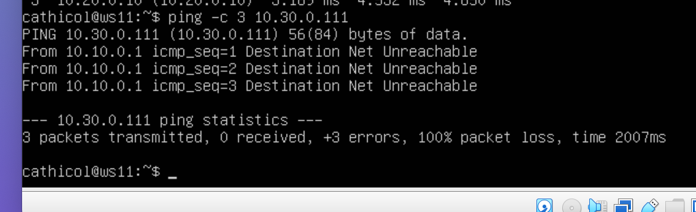\
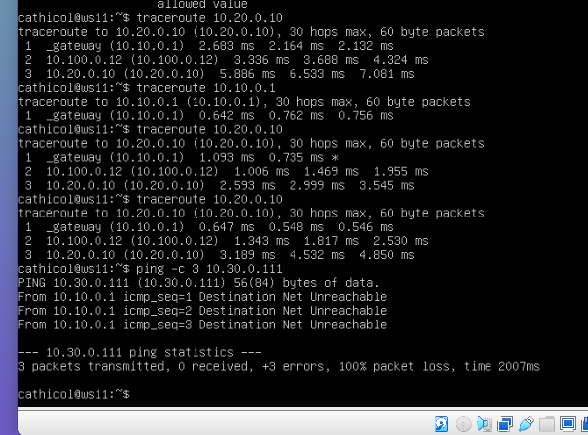\

## Part 6. Динамическая настройка IP с помощью DHCP

* Для r2 настроем в файле /etc/dhcp/dhcpd.conf конфигурацию службы DHCP:
* Укажи адрес маршрутизатора по-умолчанию, DNS-сервер и адрес внутренней сети.\
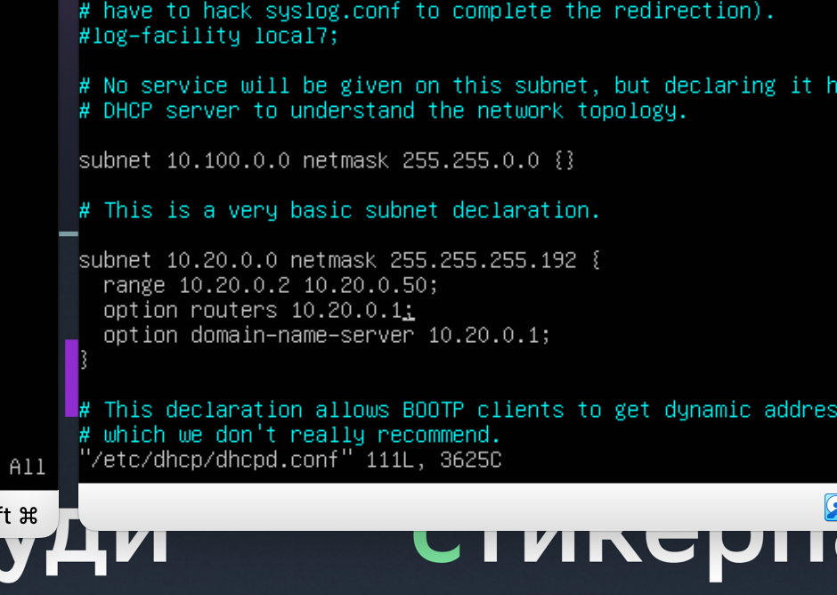\
* В файле resolv.conf пропишем `nameserver 8.8.8.8`\
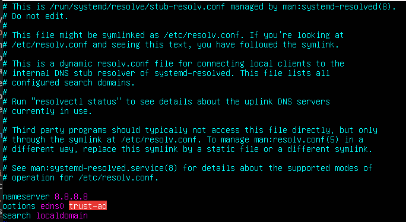\
* Перезагрузить службу DHCP командой systemctl restart isc-dhcp-server:\
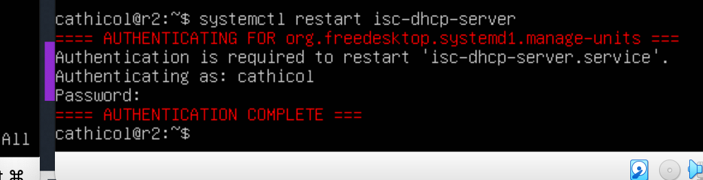\
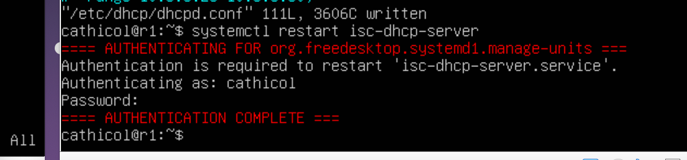\
* Машину ws21 перезагрузить при помощи `reboot` и через `ip a` показать, что она получила адрес:\
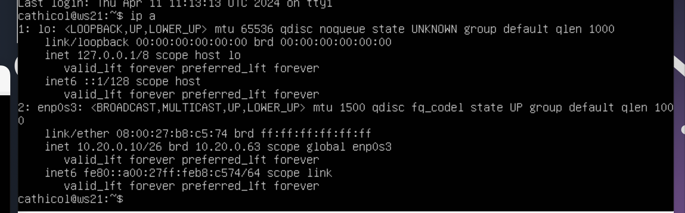\
* Также пропингуем ws22 с ws21\
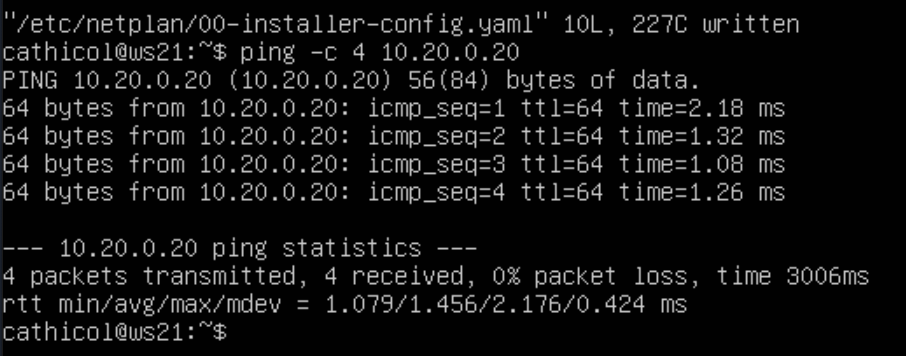\
* Укажем MAC адрес у ws11, для этого в etc/netplan/00-installer-config.yaml надо добавить строки:\
`macaddress: 10:10:10:10:10:BA`, `dhcp4: true`.\
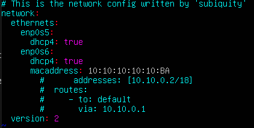\
* Для r1 настрой аналогично r2, но сделай выдачу адресов с жесткой привязкой к MAC-адресу (ws11). Проведи аналогичные тесты.\
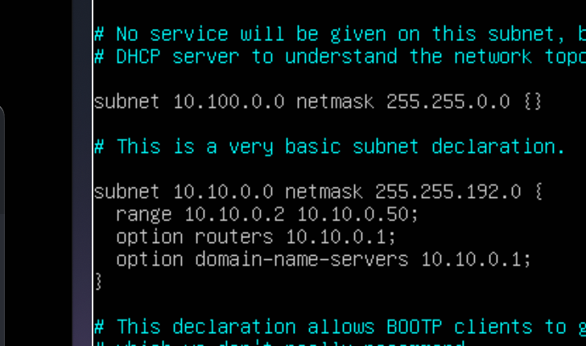\
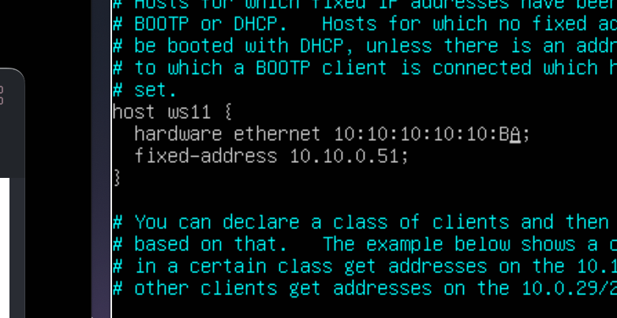\
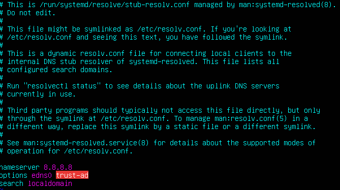\
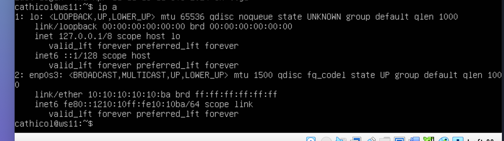\

## Part 7. NAT

* В файле /etc/apache2/ports.conf на ws22 и r1 измени строку Listen 80 на Listen 0.0.0.0:80, то есть сделай сервер Apache2 общедоступным.\
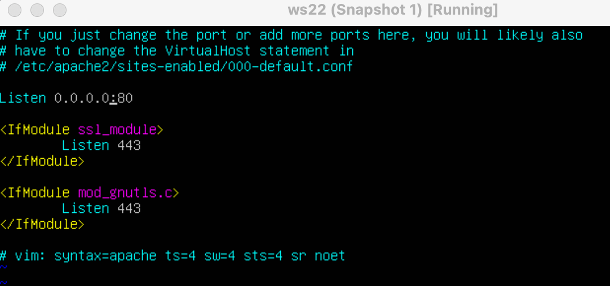\
* Запусти веб-сервер Apache командой `service apache2 start` на ws22 и r1.\
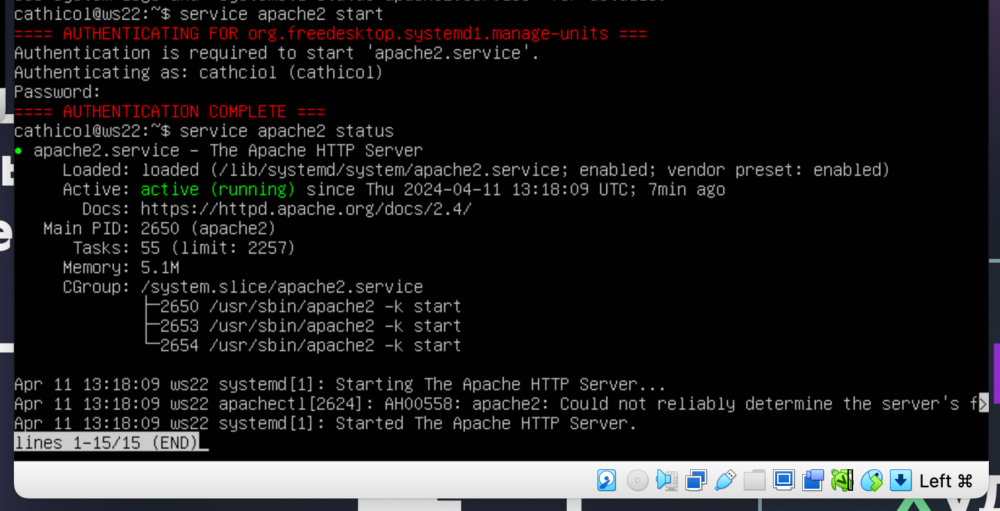\
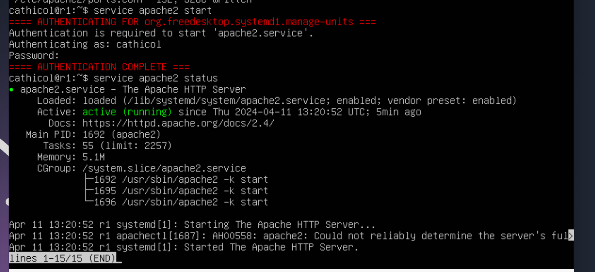\
* Добавь в фаервол, созданный по аналогии с фаерволом из Части 4, на r2 следующие правила:
1) Удаление правил в таблице filter - `iptables -F`;
2) Удаление правил в таблице "NAT" - `iptables -F -t nat`;
3) Отбрасывать все маршрутизируемые пакеты - `iptables --policy FORWARD DROP`.\
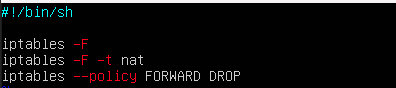\
* Запусти файл также, как в Части 4.
* Проверь соединение между ws22 и r1 командой `ping`.\
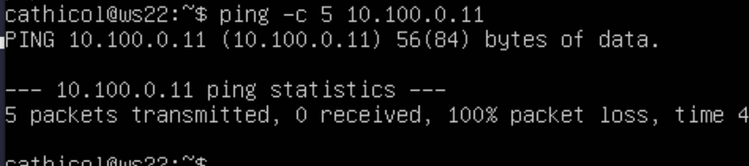\
* Добавь в файл ещё одно правило:
4) Разрешить маршрутизацию всех пакетов протокола ICMP.\
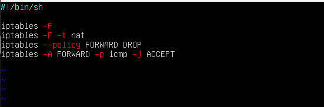\
* Запусти файл также, как в Части 4.
* Проверь соединение между ws22 и r1 командой `ping`\
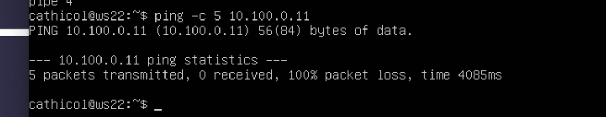\
* Добавить в файл ещё два правила:
5) Включить SNAT, а именно маскирование всех локальных ip из локальной сети, находящейся за r2 (по обозначениям из Части 5 - сеть 10.20.0.0)
6) Включить DNAT на 8080 порт машины r2 и добавить к веб-серверу Apache, запущенному на ws22, доступ извне сети\
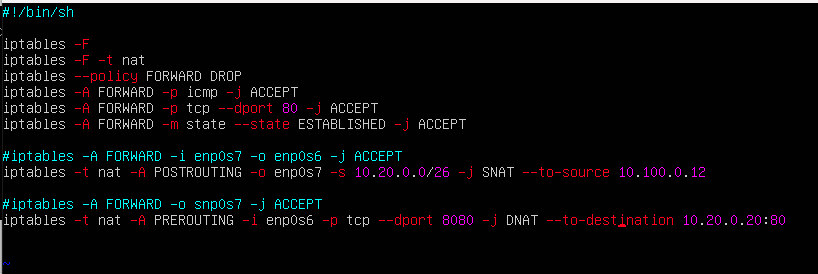\
* Запусти файл также, как в Части 4.
* Проверь соединение по TCP для SNAT: для этого с ws22 подключиться к серверу Apache на r1 командой:\
`telnet 10.100.0.11 80`\
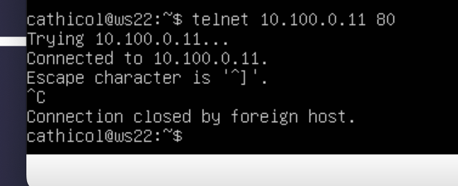\
* Проверь соединение по TCP для DNAT: для этого с r1 подключиться к серверу Apache на ws22 командой \
`telnet 10.100.0.12 8080`\
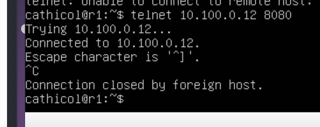\

## Part 8. Дополнительно. Знакомство с SSH Tunnels

* Запусти на r2 фаервол с правилами из Части 7.
* Запусти веб-сервер Apache на ws22 только на localhost (то есть в файле /etc/apache2/ports.conf измени строку Listen 80 на Listen localhost:80).\
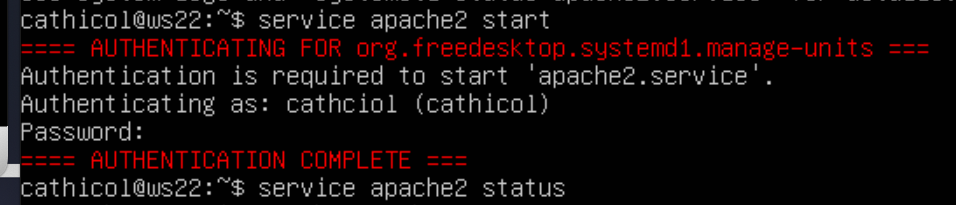\
* Воспользуйся Local TCP forwarding с ws21 до ws22, чтобы получить доступ к веб-серверу на ws22 с ws21.\
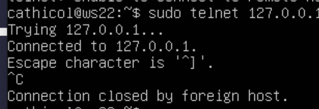\
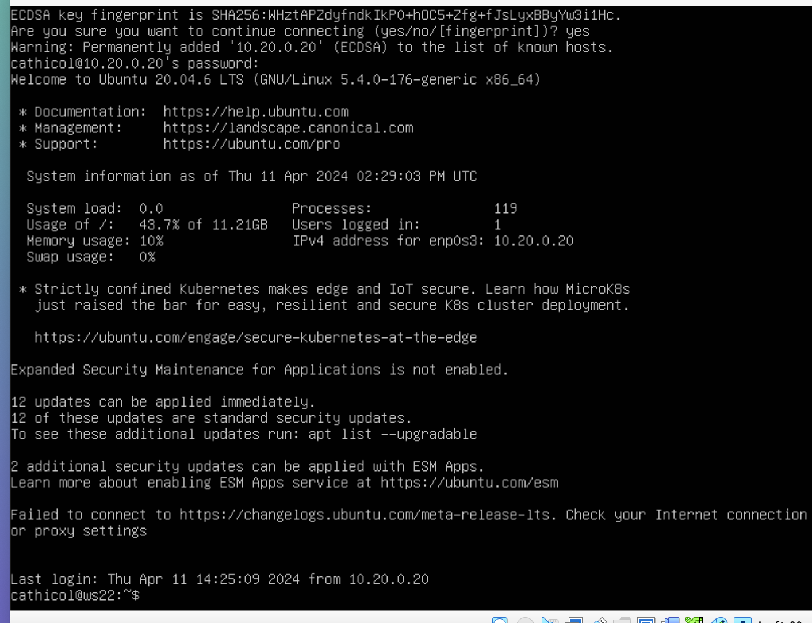\
* Воспользуйся Remote TCP forwarding c ws11 до ws22, чтобы получить доступ к веб-серверу на ws22 с ws11.\
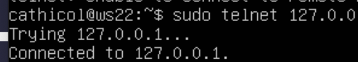\